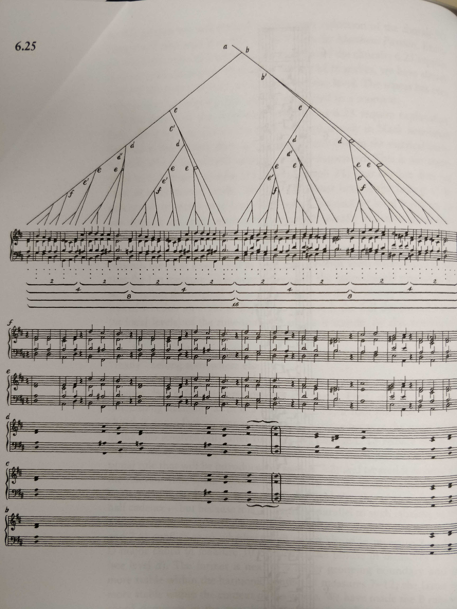
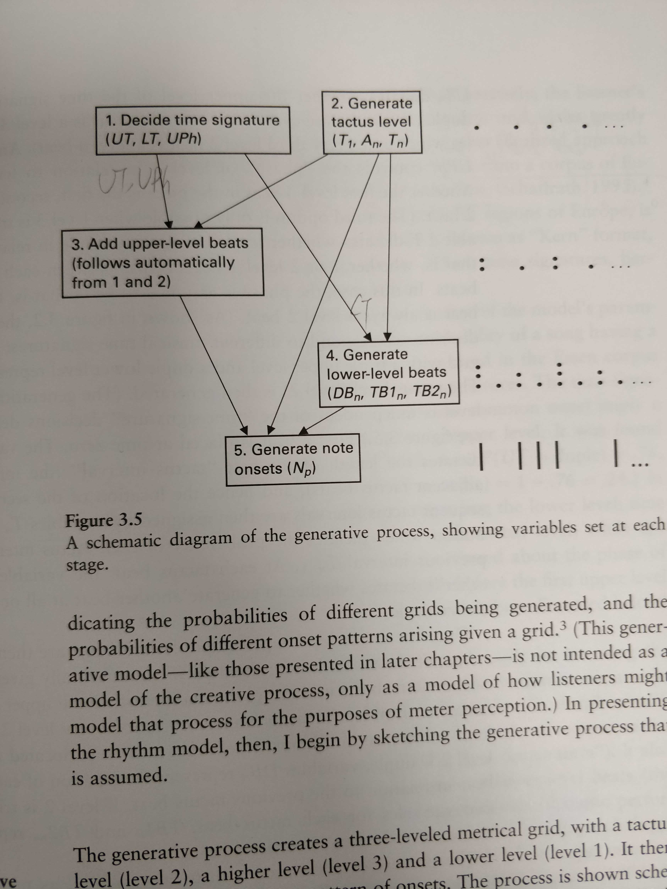
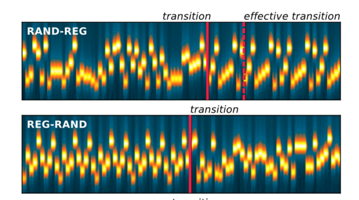
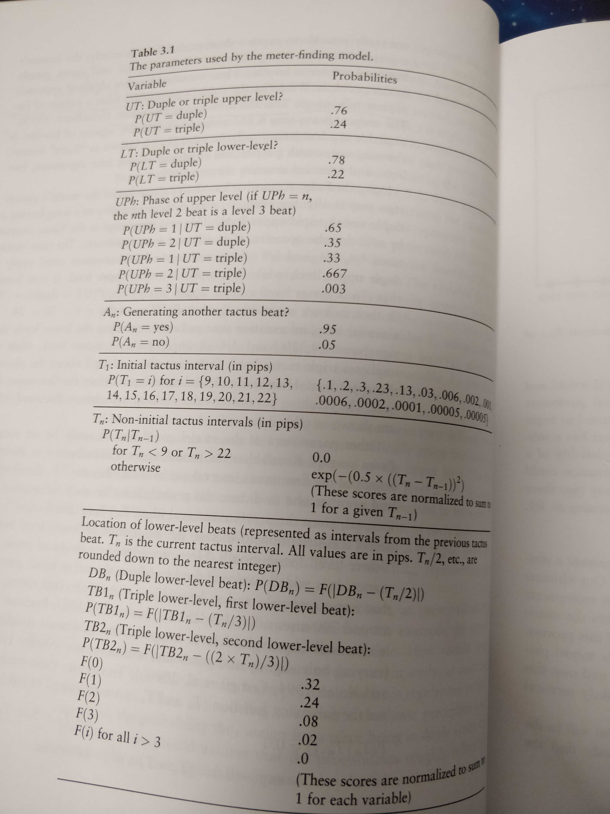
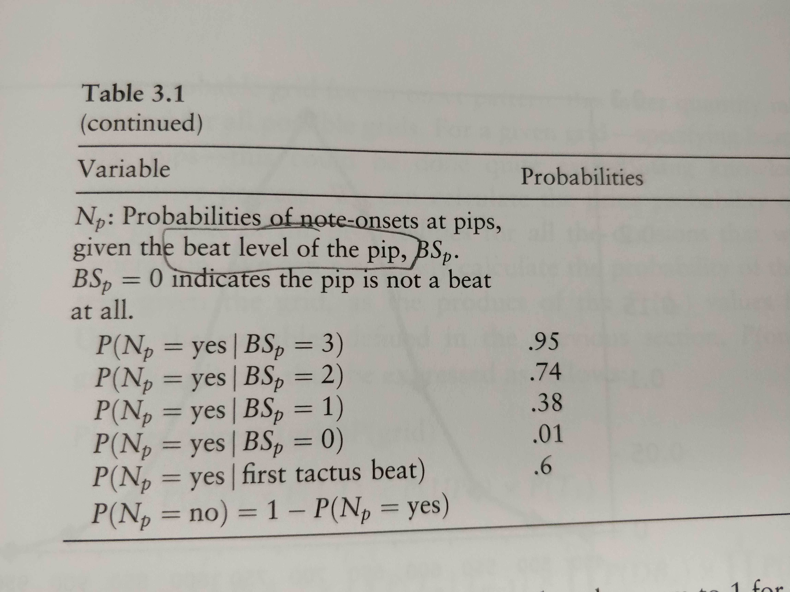
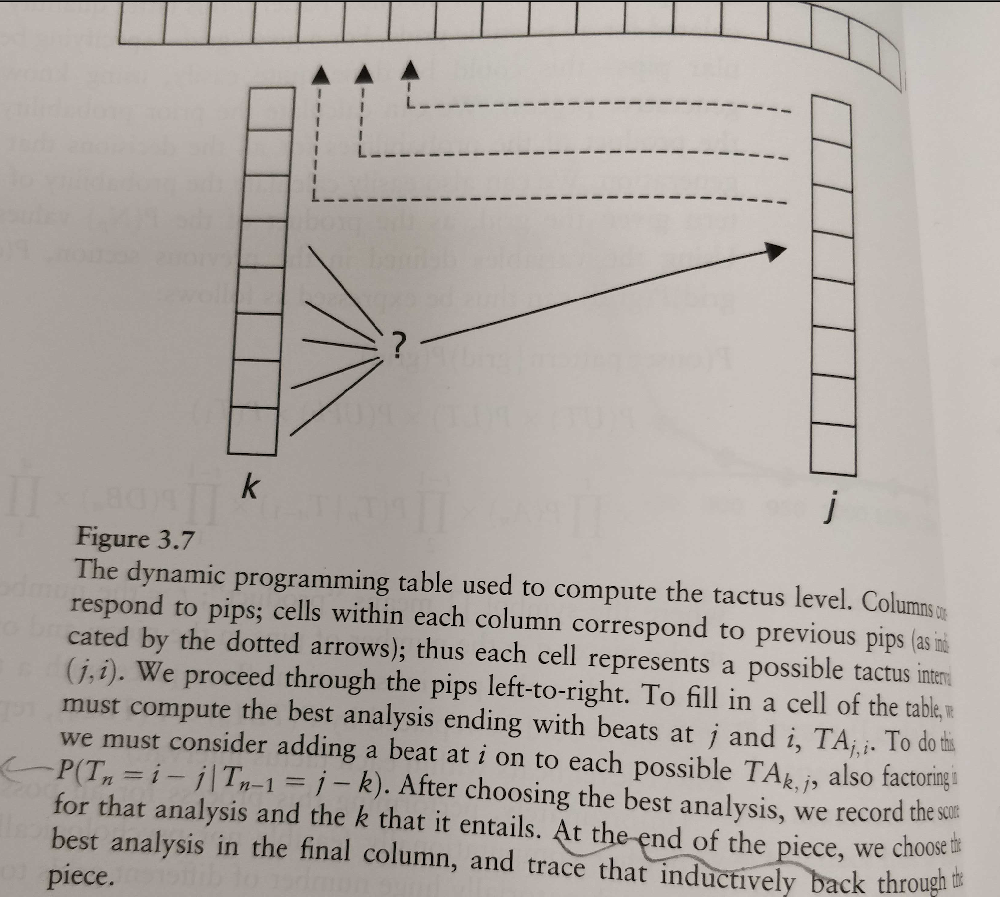

# Previous study: what they've done and what they've not done
### Generative theory of tonal music
Lerdahl and Jackendoff (1996 reprint of the 1983 book).

Time-span reduction: Hierarchical reduction, from simple to complex, by grouping music and find the “critical structure/signatures”; Then plus preference rules.

### probabilistic theory of music
David Temperley (2007 book)

Similarly, hierarchical structure, with probabilistic dependencies within and across levels. Start from tactus level (gaussian between note intervals), then develop higher or lower structures based on that.

Note that Temperley model takes into account of fine onset time for notes (in hundred milliseconds "pips") instead of a symbolic representation. 

### Information Dynamics of Music

Pearce et al 2010: Unsupervised statistical learning underpins computational, behavioural, and neural manifestations of musical expectation. 

#### Model: n-gram

How to learn this model? — First, nodes to be discretized and the features of nodes under scrutiny is selected (in this work it is the pitch interval, for relative change from the previous note, and scale degree, for an absolute pitch); Second, just count the frequency of each occurrence.

How to make prediction? — a long term model (across all pieces in the same corpus) and a short term model (for a specific piece) will be combined with weights. the model with lower entropy for current note will be given more weights.

How to select n (of n-gram)? — maintain all the possible values of n.

#### Experiment: probing response at certain notes

Behavior: perceived unexpectedness and reaction time

EEG: ???

#### Neural study

One advantage of this model is that it has been used in neural study of human capturing regularities.
> Barascud, Nicolas, Marcus T. Pearce, Timothy D. Griffiths, Karl J. Friston, and Maria Chait. “Brain Responses in Humans Reveal Ideal Observer-like Sensitivity to Complex Acoustic Patterns.” 

Here they use MEG to review when the listener captures the transition from a random sequence to a perefectly repeating sequence and show that the detection is as fast as ideal obeserver model -- which is the n-gram model.

# How is our work different
## regarding the model of rhythms
### model input and output
The input can either be symbolic input (e.g. on or off, or length of a note) or raw input extracted from the audio file. We deal with the former and not taking into account of performer's deviation or perceptual noise since we focus on higher level abstraction. 

Regarding rhythm prediction, the output should always be the probability of a note is on or off on a beat (or "pip" which is a smaller time unit in the Temperley model). 

Our model has no big difference from previous models in its input and output (and is thus comparable). 

### hidden variables
One fundamental feature of our model is the reliance on "patterns" which describe specific notes. Good hypothesis can recognize repeating patterns and that's how compression is done. The pulses of regular interval or the "downbeats" can be built into our model, but not essenstial, as in the Temperley and Lerdahl & Jackendoff.

### hypothesis space

For the n-gram model, hypothesis is the mere table of frequency and is changed continuously. For all the other model, the underlying structures are assumed and contains different levels of abstraction. 

Regarding the hierarchical structure of hypothesis, our model is orthogonal regarding the formula level and the pattern level; whereas in the Temperley model, the tactus level (level 2) is the basis of the upper and lower level.

Regarding the temporal scope under control of the structure, the Temperley model is not concerned of the overall structure of the piece and is more like markovian transitions, while the Lerdahl&Jackendoff and our model also try to predict the overall piece structure. 

### prior knowledge
For Temperley's metrical model, prior comes from statistics from the large dataset and is essential to the model prediction.

For Pearce et al. model, almost no prior information. But there's a "long term model" which studies all the other songs in a database and is weighted into the prediction (higher weight when it has higher certainty than the short term model).

For our model, the prior knowledge are some "simplicity rules", such as "formula with shorter length is preferred", "repetition of same pattern is preferred", "most likely pattern length is 4" and "clocks are more likely to be maintained throughout". The specific probabilities are parameters that can be set manually or be fitted.

## regarding complexity of music
Complexity can be measured as surprisal from the predictive model, as in the Goldilock paper. For both Temperley and Pearce et al., probability distribution on each note is available, thus complexity can be judged this way. 

However this is complexity based on likelihood. If based on the posterior of hypothesis, different models become uncompareable. It is unclear what is the right level of complexity people care about.

## regarding sequential learning progress in music
The learning progress in Pearce et al. model is smooth, since the frequency counts accumulate gradually. However I predict it will be way slower learning compared to other models with more prior knowledge of music structures.

Temperley's model is also a smooth gradual evidence accumulation and uses a dynamic programming procedure to integrate evidences (see figure below), which we can also use. 

There is hardly incremental discovery in that only when the music piece comes to an end will the algorithm collapse on a single specific hypothesis. It seems possible, however, to periodically drop some hypothesis in a particle filter manner. 

??for Lerdahl?

# What can we learn from the previous studies
- The biggest concern is the ecological validity of our model and the stimuli generated from our model. The solution is either to show the similarity between our model and some certain genre of music (say, dance and pop), or check our model's prediction power using their database.
- Although the hidden structure is different in different models, behavior data is needed to determine what do people actually perceive and use in prediction. Also it is likely to combine different levels: say, the tactus pulses can be recognized after the repeated patterns have been identified (simlar as the Essens 1995 clock model?), so that there are alternative ways to find pulses rather than heavily relying on empirical parameters. 

> Yes I do like our idea of encoding specific patterns...which also appears in fine levels in Lerdahl and Jackendoff. So keep it.

- The major contribution for us is to 1) emphasize the sequential learning and related human perceptions -- besides surprise: the joy of discovery and compression, maybe suspense. 2) since we focus on the temporal dynamics of learning, even though there is hierarchical structure in our model, we don't assume all levels are learned simultaneously. this is rather an empirical question to be tested.